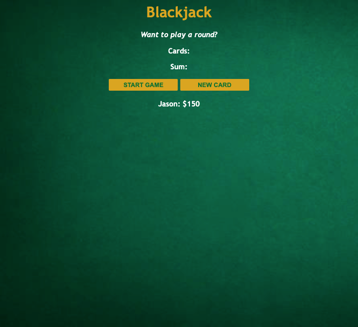

# blackjack-game

Simple blackjack game built using HTML5, CSS3, and vanilla JavaScript focusing on DOM manipulation, if-else statements, for loops and looping over arrays, functions and the return statement, the Math object, and controlling the state using variables.
